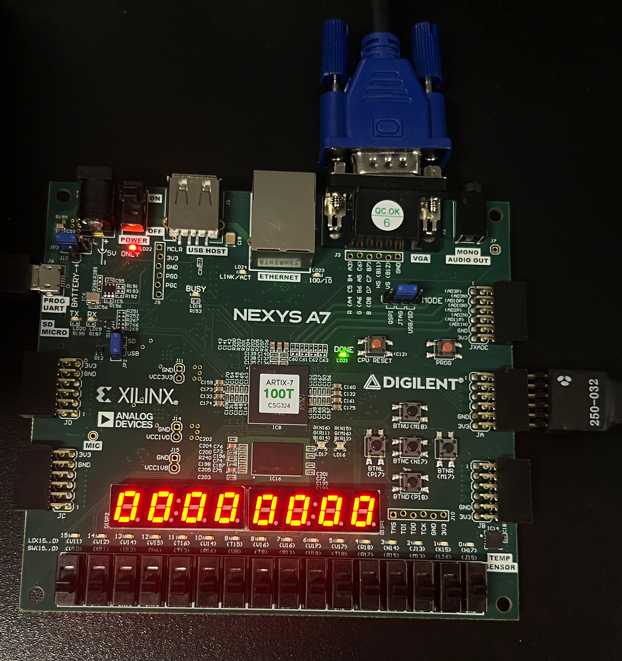
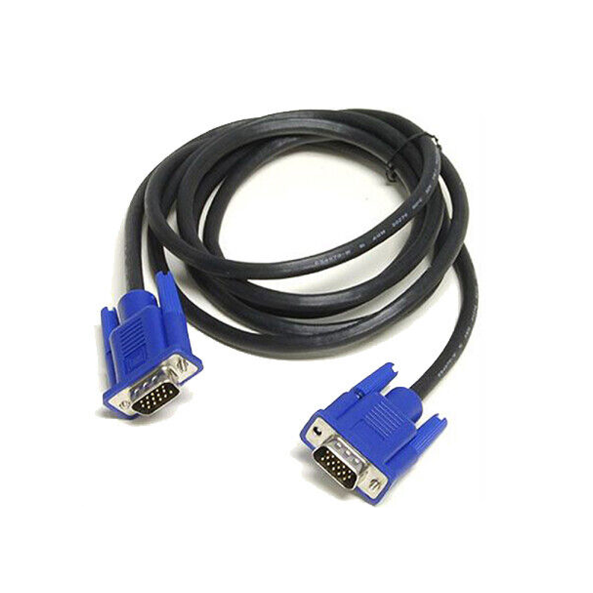
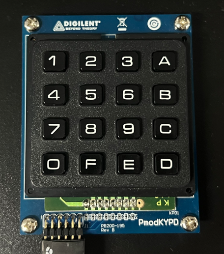
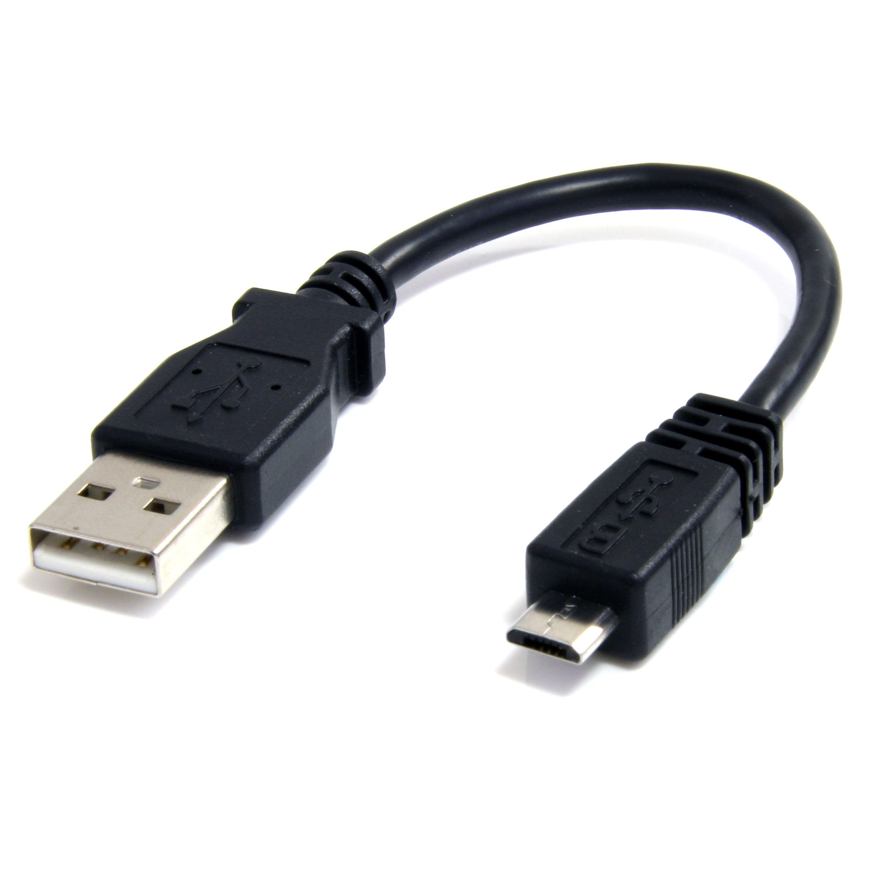

# CPE487: Final_Project - Guitar Hero
**By: Caleb Romero and Jose Martinez-Ponce** 

A guitar hero style game done on a FPGA device via VHDL


## 1. Project Overview

The main goal of this project was to create a Guitar Hero-style rhythm game using the Nexys A7 board, VGA display, and a keypad module to simulate guitar inputs. The project aimed to replicate core aspects of Guitar Hero, including note timing, input detection, scoring, and combo multipliers.

### Dummy Gameplay


***This is still a work in progress***

How to Play:
* Due to the early stage of the game, notes have to be manually spawned in
* Use the bottom row of the keypad to 'hit' notes
  - 0, F, E, D for each respective column
* To spawn manual note use:
  - BTNL, BTND, BTNR, BTNU
 

 
#### NOTE: ONLY THE FIRST TWO COLUMNS WORK AS OF THIS MOMENT

### Key Aspects of Guitar Hero:

#### Notes Falling on the Screen:

* Notes descend from the top of the screen to the bottom, where they align with target zones.

* The player interacts with the game by pressing corresponding buttons on the keypad, acting as the guitar.

#### Rhythm Detection:

* The closer the player is to hitting the note on the beat, the more points they receive.

* The visual indicator for timing accuracy is how well the note aligns with the bottom oval shape.

#### Scoring System:

* Points are awarded based on successful note hits.

* A combo system increases the player's score multiplier for consecutive correct inputs, rewarding precision and rhythm.

#### Keypad as Guitar Input:

* Four buttons on the keypad act as inputs for the game, simulating the Guitar Hero guitar.

* The project integrates the keypad module for inputs and the VGA display for visual output to create a functional rhythm game inspired by Guitar Hero.

##### Reference of Guitar Hero


## 2. Expected Behavior


* Notes descend vertically on the VGA display towards target zones.

* When a note reaches the bottom oval shape and the user presses the corresponding button, the following occurs:

  - The note is deleted from the screen to indicate a successful hit.
  
  - The player's score is updated, rewarding the user for hitting the note on rhythm.
  
* This process repeats for each individual column of notes (4 total notes column streaming down).

* Visual feedback is provided through:

    * Button color change: When a user presses a button, its color changes to visually indicate the input.

* Score Display: The player's updated score is shown on the FPGA board's display.

* Correct inputs increase the score, while missed notes break the combo multiplier.

## 3. Attachments and Requirements

In order to run and implement the project successfully, the following hardware and software is required:

  * Nexys A7 Board 100T
    
  
  
  * VGA Cable
    
  
  
  * Keypad Module
    
  

  * Micro USB Cable (Used for power)
    
   
  
  * AMD Vivado™ Design Suite

## 4. Setup

Download the following files from the repo to your computer:
* `ball.vhd`
* `buttonTracker.vhd`
* `clk_wiz_0.vhd`
* `clk_wiz_0_clk_wiz.vhd`
* `keypad.vhd`
* `leddec16.vhd`
* `songMap.vhd`
* `vgaCombiner.vhd`
* `vga_sync.vhd`
* `vga_top.vhd`
* `vga_top.xdc`

Once you have downloaded those files, follow these steps:
1. Open **AMD Vivado™ Design Suite** and create a new project
2. Add all the `.vhd` files into the source section
3. Add `vga_top.xdc` into the constraints section
4. Choose Nexys A7-100T board
5. Run Synthesis
6. Run the implementation
7. Generate the bitstream
8. Open Hardware manager
    - `Open Target`
    - `Auto Connect`
    - `Program Device`
9. Start to manually spawn in notes and "catch" them

## 5. Modules


## 6. Inputs and Outputs

### `vga_top.vhd`
```
ENTITY vga_top IS
    PORT (
        clk_in    : IN STD_LOGIC;
        vga_red   : OUT STD_LOGIC_VECTOR (2 DOWNTO 0);
        vga_green : OUT STD_LOGIC_VECTOR (2 DOWNTO 0);
        vga_blue  : OUT STD_LOGIC_VECTOR (1 DOWNTO 0);
        vga_hsync : OUT STD_LOGIC;
        vga_vsync : OUT STD_LOGIC;
        SEG7_anode : OUT STD_LOGIC_VECTOR (7 DOWNTO 0); -- anodes of eight 7-seg displays
    		SEG7_seg : OUT STD_LOGIC_VECTOR (6 DOWNTO 0); -- common segments of 7-seg displays
    		bt_clr : IN STD_LOGIC; -- calculator "clear" button
    		bt_strt : IN STD_LOGIC;
    		bt_strt1 : IN STD_LOGIC;
    		bt_strt2 : IN STD_LOGIC;
    		bt_strt3 : IN STD_LOGIC;
        KB_col : OUT STD_LOGIC_VECTOR (4 DOWNTO 1); -- keypad column pins
	      KB_row : IN STD_LOGIC_VECTOR (4 DOWNTO 1) -- keypad row pins
    );
END vga_top;
```

#### Inputs
- clk_in: System Clock
- bt_clr: Center button input, meant to restart the game
- bt_strt: Left button input, spawns note for first column
- bt_strt1: Down button input, spawns note for second column
- bt_strt2: Right button input, spawns note for third column
- bt_strt3: Up button input, spawns note for fourth column
- KB_row: Keypad row signals, used for detecting user input on the keypad

#### Outputs
 - vga_red: VGA singal controlling the **red** color inensity for the display
 - vga_green: VGA singal controlling the **green** color intensity for the display
 - vga_blue: VGA signal controlling the **blue** color intensity for the display
 - vga_hsync: Horiztonal sync signal for the VGA display
 - vga_vsync: Vertical sync signal for the VGA display
 - SEG7_anode: Controls the anodes of the 7-segment displays
 - SEG7_seg: Controls the segments of the 7-segment display
 - KB_col: keypad column signals, used to scan for keypresses on the keypad
   

### `ball.vhd`
```
ENTITY noteColumn IS
	PORT (
	    clk       : IN STD_LOGIC;
		v_sync    : IN STD_LOGIC;
		pixel_row : IN STD_LOGIC_VECTOR(10 DOWNTO 0);
		pixel_col : IN STD_LOGIC_VECTOR(10 DOWNTO 0);
		horiz     : IN STD_LOGIC_VECTOR(10 DOWNTO 0);
		note_input: IN STD_LOGIC;
		hit_signal_in : IN std_logic;
		color : IN STD_LOGIC_VECTOR(2 DOWNTO 0);
		keypress     : IN STD_LOGIC;
		hit_signal_out : OUT STD_LOGIC;
		note_col_out  : OUT STD_LOGIC_VECTOR(599 DOWNTO 0);
		red       : OUT STD_LOGIC;
		green     : OUT STD_LOGIC;
		blue      : OUT STD_LOGIC
	);
END noteColumn;
```
#### Inputs
 - clk: System Clock
 - v_sync: vertical sync signal
 - pixel_row: current row pixel position of VGA
 - pixel_col: current column pixel position of VGA
 - horiz: Horitzontal position where note column is drawn
 - note_input: Input signal indicating a new note should be created
 - hit_signal_in: Input signal indicating the note was successfully hit
 - color: Input color value for the note and note column
 - keypress: Input signal indicating that the user pressed the key/button

#### Outputs
 - hit_signal_out: Output signal indicating the note was hit and cleared
 - note_col_out: Vector output representing the state of the note column
 - red: Red color signal
 - green: Green color signal
 - blue: Blue color signal

### `buttonTracker.vhd`
```
entity buttonTracker is
    PORT (
        clk          : IN  STD_LOGIC;
        reset        : IN  STD_LOGIC;
        keypress     : IN  STD_LOGIC; -- 4 keypad inputs
        note_col_1   : IN  STD_LOGIC_VECTOR(599 DOWNTO 0); -- Falling notes from column 1
        hit_sigB_1 : IN STD_LOGIC;
        hit_signal_1 : OUT STD_LOGIC; -- Signal to delete notes
        score        : OUT STD_LOGIC_VECTOR(31 DOWNTO 0) -- Score output
    );
end buttonTracker;
```
#### Inputs
 - clk: System Clock
 - reset: Reset Signal to clear the score and reset internal states
 - keypress: Indicates if a button/key on the keypad has been pressed
 - note_col_1: Falling notes in column X, represented as a vector of 600 bits
 - hit_sigB_1: Signal indicating a hit event, which clears a note in the falling column

#### Outputs
 - hit_signal_1: Output signal to delete notes in column X after a successful hit
 - score: Current score output as a 32-bit vector, updated upon successful hits

### `vgaCombiner.vhd`
```
ENTITY colorCombiner IS
	PORT (
		clk : IN STD_LOGIC;
		red_inputs   : IN STD_LOGIC_VECTOR(3 DOWNTO 0); -- Supports up to 8 columns
		green_inputs : IN STD_LOGIC_VECTOR(3 DOWNTO 0);
		blue_inputs  : IN STD_LOGIC_VECTOR(3 DOWNTO 0);
		red_out      : OUT STD_LOGIC;
		green_out    : OUT STD_LOGIC;
		blue_out     : OUT STD_LOGIC
	);
END colorCombiner;
```
#### Inputs
 - clk: System Clock
 - red_inputs: 4-bit input for red color channels
 - green_inputs: 4-bit input for green color channels
 - blue_inputs: 4-bit input for blue color channels

#### Outputs
 - red_out: Combined red output color
 - green_out: Combined green output color
 - blue_out: Combined blue output color


### `songMap`
```
ENTITY songMap IS
    GENERIC (
        song_map : STD_LOGIC_VECTOR(599 DOWNTO 0) -- Song map for the column
    );
    PORT (
        clk          : IN  STD_LOGIC;  -- Clock input
        reset        : IN  STD_LOGIC;  -- Reset signal to restart the song
        song_pointer : OUT INTEGER RANGE 0 TO 599; -- Current pointer in the song map
        note_active  : OUT STD_LOGIC   -- Indicates if a note is active at the current pointer
    );
END songMap;
```
#### Inputs
 - clk: System Clock
 - reset: Reset signal to restart the song pointer back to the beginning

#### Outputs
 - song_pointer: Indicates the current position/pointer in the `song_map`
 - note_active: Indicates whether a note is active at the current pointer position

#### Generics
 - song_map: A 600-bit vector representing the song map for a single note column. Each bit corresponds to a note position

## 7. Modifications

### `ball.vhd`

The note funtionally behind our program was based off `ball.vhd` from lab 3. We have modified `ball.vhd` to be anything from a bouncing ball, as we  generalized it to become falling notes. Instead of just one "ball" bouncing vertically, the logic was futher extended to handle falling notes from the top of the screen to the bottom. In addition, this allowed to have notes appear at fixed horizontal positions (columns) and move downwards. As well, we also changed the logic on how color is assigned to the ball.

We removed the logic of bouncing off the bottom of the screen, as we just wanted to have a note to fall downward only. 

#### Modified Code: 
#### Changes: 
*Modified:* We added a check for falling notes based on column position (`hotiz`) and a vector (`note_col`) representing note activity in the song. 
```
-- Determine if the current pixel aligns with a falling note position
ndraw : PROCESS (note_input, note_col, pixel_row, pixel_col)
BEGIN
    IF note_input = '1' THEN
        new_note <= '1';
    ELSE
        new_note <= '0';
    END IF;

    IF pixel_col >= horiz - size AND
       pixel_col <= horiz + size THEN
        FOR i IN 0 TO 14 LOOP
            IF CONV_INTEGER(pixel_row) + i - 7 >= 0 AND
               CONV_INTEGER(pixel_row) + i - 7 < 600 AND
               note_col(CONV_INTEGER(pixel_row) + i - 7) = '1' THEN
                note_on <= '1';
                EXIT;
            END IF;
        END LOOP;
    ELSE
        note_on <= '0';
    END IF;
END PROCESS;
```

#### Changes: 
*Modified:* Notes move downward continuously by shifting the `note_col` vector. New notes can be added at the top, and notes are deleted when a hit signal is recieved. 
```
mcolumn : PROCESS(local_clk)
BEGIN
    IF rising_edge(local_clk) THEN  
        -- Shift note positions down by 1
        note_col(599 DOWNTO 1) <= note_col(598 DOWNTO 0);
        
        IF new_note = '1' THEN
            note_col(0) <= '1'; -- Add a new note at the top
        ELSE
            note_col(0) <= '0';
        END IF;

        -- Delete notes if hit signal is received
        IF hit_signal_in = '1' THEN
            note_col(580 DOWNTO 550) <= (OTHERS => '0');
            hit_signal_out <= '1';
        ELSE
            hit_signal_out <= '0';
        END IF;
    END IF;
END PROCESS;
```

#### Changes: 
*Modified:* Notes can have dynamic colors using an input `color` vector, and feedback is provided for a keypress (note turns black).

```
IF note_on = '0' THEN
    red <= '1';
    green <= '1';
    blue <= '1';
END IF;

IF note_on = '1' THEN
    red <= color(2);
    green <= color(1);
    blue <= color(0);
END IF;

-- Visual feedback for keypress
IF keypress = '1' AND condition THEN
    red <= '0';
    green <= '0';
    blue <= '0';
END IF;
```

### `leddec16.vhd`

We modified `leddec16` from lab_6 to expand its functionality from supporting 4 digits to 8 digits.  Other than that, nothing else was changed. 

#### Modified Code: 

#### Changes: 
*Modified:* The `data` input was expanded from 16 bits (4 digits) to 32 bits (8 digits)
```
data : IN STD_LOGIC_VECTOR (31 DOWNTO 0); -- 32-bit (8-digit) data
```

#### Changes: 
*Modified:* The digit selection logic again was extended to handle 8 digits
```
data4 <= data(3 DOWNTO 0) WHEN dig = "000" ELSE -- digit 0
         data(7 DOWNTO 4) WHEN dig = "001" ELSE -- digit 1
         data(11 DOWNTO 8) WHEN dig = "010" ELSE -- digit 2
         data(15 DOWNTO 12) WHEN dig = "011" ELSE -- digit 3
         data(19 DOWNTO 16) WHEN dig = "100" ELSE -- digit 4
         data(23 DOWNTO 20) WHEN dig = "101" ELSE -- digit 5
         data(27 DOWNTO 24) WHEN dig = "110" ELSE -- digit 6
         data(31 DOWNTO 28); -- digit 7
```


#### Changes: 
*Modified:* The `anode` output logic was expanded to control 8 digits
```
anode <= "11111110" WHEN dig = "000" ELSE -- 0
         "11111101" WHEN dig = "001" ELSE -- 1
         "11111011" WHEN dig = "010" ELSE -- 2
         "11110111" WHEN dig = "011" ELSE -- 3
         "11101111" WHEN dig = "100" ELSE -- 4
         "11011111" WHEN dig = "101" ELSE -- 5
         "10111111" WHEN dig = "110" ELSE -- 6
         "01111111" WHEN dig = "111" ELSE -- 7
         "11111111";
```

### `keypad.vhd`

In our modified version of `keypad.vhd` from lab 4, we added the ability to detect individual keypress outputs for notes.

#### Modified Code:
#### Changes: 
*Modified:* We added in a new signal `keypress_out` to track the output of inidividual bits for specific keys
```
keypress_out : OUT STD_LOGIC_VECTOR (3 DOWNTO 0); -- keypresses for notes
```

#### Changes: 
*Modified:* The logic was split into separate processes for detecting specific keys: Where: 

	 `keypress0` for button `0`
 	 `keypress1` for button `F`
  	 `keypress2` for button `E`
   	 `keypress3` for button `D`
    
* This allows for modular handing of key detection
```
blue_proc : PROCESS (CV1)
BEGIN  
    IF CV1(4) = '0' THEN -- Column 1, Row 4 (Button "0")
        keypress0 <= '1';
    ELSE 
        keypress0 <= '0';
    END IF;
END PROCESS;

red_proc : PROCESS (CV2)
BEGIN  
    IF CV2(4) = '0' THEN -- Column 2, Row 4 (Button "F")
        keypress1 <= '1';
    ELSE 
        keypress1 <= '0';
    END IF;
END PROCESS;

green_proc : PROCESS (CV3)
BEGIN  
    IF CV3(4) = '0' THEN -- Column 3, Row 4 (Button "E")
        keypress2 <= '1';
    ELSE 
        keypress2 <= '0';
    END IF;
END PROCESS;

purple_proc : PROCESS (CV4)
BEGIN  
    IF CV4(4) = '0' THEN -- Column 4, Row 4 (Button "D")
        keypress3 <= '1';
    ELSE 
        keypress3 <= '0';
    END IF;
END PROCESS;
```

#### Changes: 
*Modified:* The `hit` signal is no longer needed because the inidivudal `keypress_out` bits are now used to signal note presses.
```
-- hit <= '1'; (Commented Out)
```

#### Changes: 
*Modified:* This makes sures that `keypress_out` reflects the individual keypress signals in real time
```
keypress_out(0) <= keypress0;
keypress_out(1) <= keypress1;
keypress_out(2) <= keypress2;
keypress_out(3) <= keypress3;
```

### `vga_top.xdc`

We modified the constrants file in order to include the buttons from the board, the keys from the keypad, and the display from the board.

```
## Clock signal
set_property -dict { PACKAGE_PIN E3    IOSTANDARD LVCMOS33 } [get_ports { clk_in }]; #IO_L12P_T1_MRCC_35 Sch=clk100mhz
create_clock -add -name sys_clk_pin -period 10.00 -waveform {0 5} [get_ports {clk_in }];

##VGA Connector

set_property -dict { PACKAGE_PIN A3    IOSTANDARD LVCMOS33 } [get_ports { vga_red[0] }]; #IO_L8N_T1_AD14N_35 Sch=vga_r[0]
set_property -dict { PACKAGE_PIN B4    IOSTANDARD LVCMOS33 } [get_ports { vga_red[1] }]; #IO_L7N_T1_AD6N_35 Sch=vga_r[1]
set_property -dict { PACKAGE_PIN C5    IOSTANDARD LVCMOS33 } [get_ports { vga_red[2] }]; #IO_L1N_T0_AD4N_35 Sch=vga_r[2]

set_property -dict { PACKAGE_PIN C6    IOSTANDARD LVCMOS33 } [get_ports { vga_green[0] }]; #IO_L1P_T0_AD4P_35 Sch=vga_g[0]
set_property -dict { PACKAGE_PIN A5    IOSTANDARD LVCMOS33 } [get_ports { vga_green[1] }]; #IO_L3N_T0_DQS_AD5N_35 Sch=vga_g[1]
set_property -dict { PACKAGE_PIN B6    IOSTANDARD LVCMOS33 } [get_ports { vga_green[2] }]; #IO_L2N_T0_AD12N_35 Sch=vga_g[2]

set_property -dict { PACKAGE_PIN B7    IOSTANDARD LVCMOS33 } [get_ports { vga_blue[0] }]; #IO_L2P_T0_AD12P_35 Sch=vga_b[0]
set_property -dict { PACKAGE_PIN C7    IOSTANDARD LVCMOS33 } [get_ports { vga_blue[1] }]; #IO_L4N_T0_35 Sch=vga_b[1]

set_property -dict { PACKAGE_PIN B11   IOSTANDARD LVCMOS33 } [get_ports { vga_hsync }]; #IO_L4P_T0_15 Sch=vga_hs
set_property -dict { PACKAGE_PIN B12   IOSTANDARD LVCMOS33 } [get_ports { vga_vsync }]; #IO_L3N_T0_DQS_AD1N_15 Sch=vga_vs

#reset
set_property -dict { PACKAGE_PIN N17   IOSTANDARD LVCMOS33 } [get_ports { bt_clr }]; #IO_L9P_T1_DQS_14 Sch=btnc
set_property -dict { PACKAGE_PIN P17   IOSTANDARD LVCMOS33 } [get_ports { bt_strt }]; #IO_L12P_T1_MRCC_14 Sch=btnl
set_property -dict { PACKAGE_PIN P18   IOSTANDARD LVCMOS33 } [get_ports { bt_strt1 }]; #IO_L9N_T1_DQS_D13_14 Sch=btnd
set_property -dict { PACKAGE_PIN M17   IOSTANDARD LVCMOS33 } [get_ports { bt_strt2 }]; #IO_L10N_T1_D15_14 Sch=btnr
set_property -dict { PACKAGE_PIN M18   IOSTANDARD LVCMOS33 } [get_ports { bt_strt3 }]; #IO_L4N_T0_D05_14 Sch=btnu


##Pmod Header JA

set_property -dict { PACKAGE_PIN C17   IOSTANDARD LVCMOS33 } [get_ports { KB_col[4] }]; #IO_L20N_T3_A19_15 Sch=ja[1]
set_property -dict { PACKAGE_PIN D18   IOSTANDARD LVCMOS33 } [get_ports { KB_col[3] }]; #IO_L21N_T3_DQS_A18_15 Sch=ja[2]
set_property -dict { PACKAGE_PIN E18   IOSTANDARD LVCMOS33 } [get_ports { KB_col[2] }]; #IO_L21P_T3_DQS_15 Sch=ja[3]
set_property -dict { PACKAGE_PIN G17   IOSTANDARD LVCMOS33 } [get_ports { KB_col[1] }]; #IO_L18N_T2_A23_15 Sch=ja[4]
set_property -dict { PACKAGE_PIN D17   IOSTANDARD LVCMOS33 } [get_ports { KB_row[4] }]; #IO_L16N_T2_A27_15 Sch=ja[7]
set_property -dict { PACKAGE_PIN E17   IOSTANDARD LVCMOS33 } [get_ports { KB_row[3] }]; #IO_L16P_T2_A28_15 Sch=ja[8]
set_property -dict { PACKAGE_PIN F18   IOSTANDARD LVCMOS33 } [get_ports { KB_row[2] }]; #IO_L22N_T3_A16_15 Sch=ja[9]
set_property -dict { PACKAGE_PIN G18   IOSTANDARD LVCMOS33 } [get_ports { KB_row[1] }]; #IO_L22P_T3_A17_15 Sch=ja[10]

##7-Segment Display
set_property -dict {PACKAGE_PIN L18 IOSTANDARD LVCMOS33} [get_ports {SEG7_seg[0]}]
set_property -dict {PACKAGE_PIN T11 IOSTANDARD LVCMOS33} [get_ports {SEG7_seg[1]}]
set_property -dict {PACKAGE_PIN P15 IOSTANDARD LVCMOS33} [get_ports {SEG7_seg[2]}]
set_property -dict {PACKAGE_PIN K13 IOSTANDARD LVCMOS33} [get_ports {SEG7_seg[3]}]
set_property -dict {PACKAGE_PIN K16 IOSTANDARD LVCMOS33} [get_ports {SEG7_seg[4]}]
set_property -dict {PACKAGE_PIN R10 IOSTANDARD LVCMOS33} [get_ports {SEG7_seg[5]}]
set_property -dict {PACKAGE_PIN T10 IOSTANDARD LVCMOS33} [get_ports {SEG7_seg[6]}]

set_property -dict {PACKAGE_PIN U13 IOSTANDARD LVCMOS33} [get_ports {SEG7_anode[7]}]
set_property -dict {PACKAGE_PIN K2 IOSTANDARD LVCMOS33} [get_ports {SEG7_anode[6]}]
set_property -dict {PACKAGE_PIN T14 IOSTANDARD LVCMOS33} [get_ports {SEG7_anode[5]}]
set_property -dict {PACKAGE_PIN P14 IOSTANDARD LVCMOS33} [get_ports {SEG7_anode[4]}]
set_property -dict {PACKAGE_PIN J14 IOSTANDARD LVCMOS33} [get_ports {SEG7_anode[3]}]
set_property -dict {PACKAGE_PIN T9 IOSTANDARD LVCMOS33} [get_ports {SEG7_anode[2]}]
set_property -dict {PACKAGE_PIN J18 IOSTANDARD LVCMOS33} [get_ports {SEG7_anode[1]}]
set_property -dict {PACKAGE_PIN J17 IOSTANDARD LVCMOS33} [get_ports {SEG7_anode[0]}]
```

## 8. Main Process and Sub Processes

### `vga_top.vhd`

The vga_top entity serves as the top-level module that inegrates all the components of the Guitar Hero game. This module connects VGA output, keypad input, note columns, scoring system, and a 7-segment display to create a final design. 

### Note Columns Instantiations

Four note columns were instantiated, where each handle a specific color (Green, Red, Purple, and Blue). Each column processes: 
 - Falling notes
 - Keypress detection
 - Output signal for scoring and VGA display

Example of a Note Column:
```
green_note : noteColumn
PORT MAP(
    clk        => clk_in,
    v_sync     => S_vsync,
    pixel_row  => S_pixel_row,
    pixel_col  => S_pixel_col,
    horiz      => conv_std_logic_vector(160,11),
    note_input => bt_strt1,
    hit_signal_in => hit_signals_out(0),
    note_col_out   => note_column1,
    color => "010", -- Green
    keypress => keypresses(0),
    hit_signal_out => hit_signals_back(0),
    red        => S_red1,
    green      => S_green1,
    blue       => S_blue1
);
```
### Block Diagram of `vga_top`

```mermaid
flowchart TD
    clk_in(Clock Input) --> clk_wiz[Clock Divider]
    clk_wiz --> pxl_clk[Pixel Clock]

    %% VGA Sync
    pxl_clk --> vga_sync[VGA Sync Module]
    vga_sync --> vga_red[VGA Red Output]
    vga_sync --> vga_green[VGA Green Output]
    vga_sync --> vga_blue[VGA Blue Output]
    vga_sync --> vga_hsync[Horizontal Sync]
    vga_sync --> vga_vsync[Vertical Sync]
    vga_sync --> pixel_row[Pixel Row]
    vga_sync --> pixel_col[Pixel Column]

    %% Note Columns
    bt_strt1(Button Start 1) --> green_note[NoteColumn 1]
    bt_strt(Button Start 2) --> red_note[NoteColumn 2]
    bt_strt2(Button Start 3) --> purple_note[NoteColumn 3]
    bt_strt3(Button Start 4) --> blue_note[NoteColumn 4]

    green_note --> s_red1(Red Signal 1) & s_green1(Green Signal 1) & s_blue1(Blue Signal 1)
    red_note --> s_red2(Red Signal 2) & s_green2(Green Signal 2) & s_blue2(Blue Signal 2)
    purple_note --> s_red3(Red Signal 3) & s_green3(Green Signal 3) & s_blue3(Blue Signal 3)
    blue_note --> s_red4(Red Signal 4) & s_green4(Green Signal 4) & s_blue4(Blue Signal 4)

    %% Color Combiner
    s_red1 & s_red2 & s_red3 & s_red4 --> colorCombiner[Color Combiner]
    colorCombiner --> fin_red[Final Red Output]
    colorCombiner --> fin_green[Final Green Output]
    colorCombiner --> fin_blue[Final Blue Output]

    colorCombiner --> vga_sync

    %% Keypad
    keypad[Keypad Module] --> keypresses[Keypresses Signals]
    keypresses --> green_note
    keypresses --> red_note
    keypresses --> purple_note
    keypresses --> blue_note

    %% Button Trackers
    keypresses --> green_tracker[ButtonTracker 1]
    green_tracker --> green_score(Green Score)

    keypresses --> red_tracker[ButtonTracker 2]
    red_tracker --> red_score(Red Score)

    keypresses --> purple_tracker[ButtonTracker 3]
    purple_tracker --> purple_score(Purple Score)

    keypresses --> blue_tracker[ButtonTracker 4]
    blue_tracker --> blue_score(Blue Score)

    green_score --> total_score[Total Score Calculation]
    red_score --> total_score
    purple_score --> total_score
    blue_score --> total_score

    total_score --> seg7[Seven Segment Display]

    %% Outputs
    vga_red --> VGA{VGA Display}
    vga_green --> VGA
    vga_blue --> VGA
    seg7 --> SEG7{7-Segment Display}

    kb_col(Keypad Columns) --> keypad
    kb_row(Keypad Rows) --> keypad

